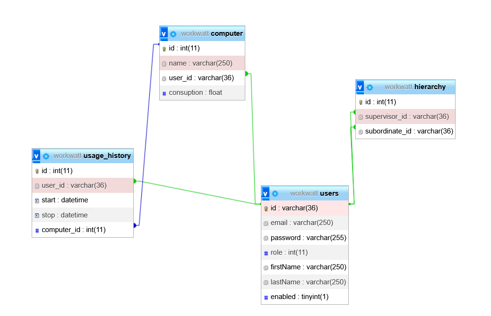

# WorkWatt-Backend

## Endpoints:

### Authentication:

### 1. `POST /api/v1/auth/authenticate`

Służy do uwierzytelniania istniejącego użytkownika (logowanie).

####  Request body
```json
{
  "email": "user@example.com",
  "password": "yourPassword123"
}
```
### 2. `POST /api/v1/auth/register`

Służy do rejestrowania nowego użytkownika.

####  Request body

```json
{
  "email": "user@example.com",
  "firstName": "John",
  "lastName": "Doe",
  "role": 0
}
```
## Database diagram:

